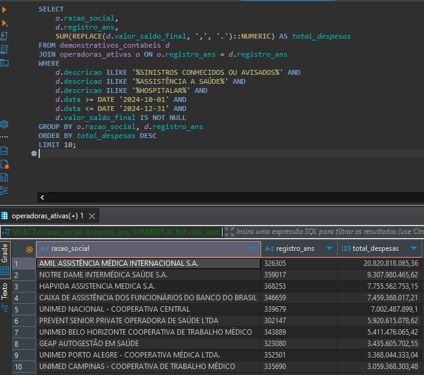
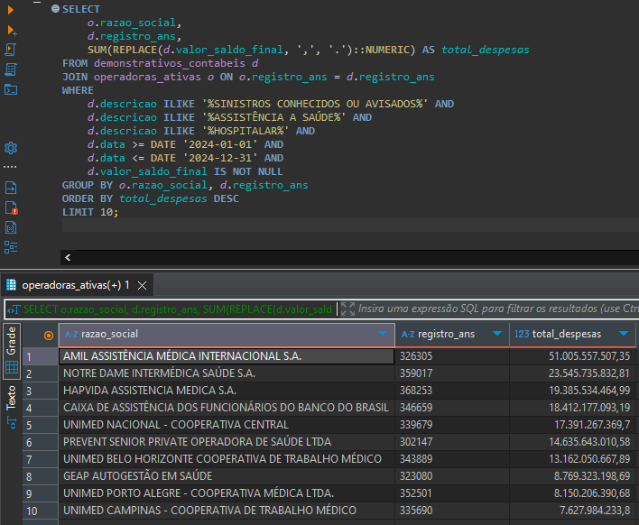

## 📊 Consulta Analítica com PostgreSQL

Este projeto contém a estrutura e análise solicitada no **Teste de Banco de Dados**, utilizando PostgreSQL e DBeaver.

---

## 📚 Fontes de Dados Utilizadas

- **Cadastro de operadoras ativas:** CSV obtido em  
  `https://dadosabertos.ans.gov.br/FTP/PDA/operadoras_de_plano_de_saude_ativas/`

- **Demonstrativos contábeis dos últimos dois anos:**  
  Arquivos `.csv` extraídos dos `.zip` organizados por semestre em  
  `https://dadosabertos.ans.gov.br/FTP/PDA/demonstracoes_contabeis/`

---

## 🏗️ Estrutura das Tabelas

### 🔸 `operadoras_ativas`
Tabela contendo os dados principais de cadastro das operadoras.

Campos relevantes:  
`registro_ans`, `razao_social`, `modalidade`, `email`, `regiao_comercializacao`

### 🔸 `demonstrativos_contabeis`
Tabela contendo os lançamentos contábeis relacionados a despesas médicas.

Campos relevantes:  
`registro_ans`, `descricao`, `valor_saldo_final`, `data`

---

## 🛠️ Processamento e Tratamento

Durante a preparação dos dados:

- Corrigimos o encoding para `UTF-8`, preservando acentuação e caracteres especiais.
- Renomeamos colunas importadas com nomes alternativos (ex: `reg_ans` → `registro_ans`, `vl_saldo_final` → `valor_saldo_final`).
- Realizamos limpeza e padronização de tipo (`NUMERIC`, `VARCHAR`), com `REPLACE` para transformar vírgula em ponto decimal.
- Fixamos datas de análise para respeitar o intervalo presente nos dados (2023 a 2024).

---

## 📈 Resultado — Último Trimestre de 2024

> **Consulta:** Operadoras com maiores despesas em "EVENTOS/ SINISTROS CONHECIDOS OU AVISADOS DE ASSISTÊNCIA A SAÚDE MÉDICO HOSPITALAR" entre **01/10/2024 e 31/12/2024**

---

## 📅 Resultado — Ano de 2024

> **Consulta:** Operadoras com maiores despesas na mesma categoria entre **01/01/2024 e 31/12/2024**

---

## ✅ Considerações Finais

- As queries foram testadas com sucesso em base real, via DBeaver + PostgreSQL.
- As datas foram fixadas por conta do desvio do `CURRENT_DATE` (estamos em 2025, mas os dados vão até 2024).
- Toda a análise foi conduzida garantindo legibilidade, rastreabilidade e uso eficiente de índices e filtros.
