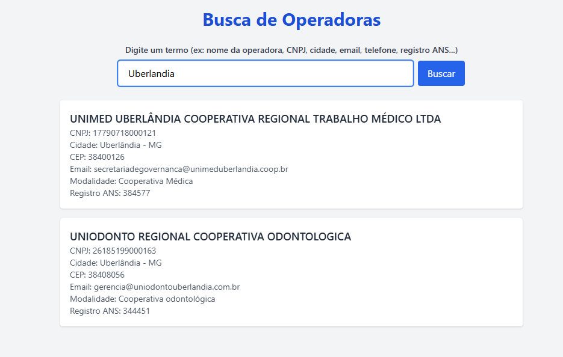

# 🔍 Buscador de Operadoras de Saúde

Este projeto é uma aplicação **fullstack** com backend em **Python** e frontend em **Vue.js**. O sistema permite buscar operadoras de saúde com base em informações como nome, CNPJ, cidade, email, telefone, registro ANS e mais.

---

## 🧠 Tecnologias Utilizadas

### Backend (API RESTful)
- Python
- Flask
- Pandas
- Flask-CORS
- Arquitetura MVC

### Frontend
- Vue.js 3 (Vite)
- Tailwind CSS
- Fetch API

---

## 📂 Estrutura do Projeto

```
ex4/
├── backend/
│   ├── app.py
│   ├── Control/
│   │   └── operadora_controller.py
│   ├── Model/
│   │   └── operadora_model.py
│   ├── View/
│   │   └── routes.py
│   └── Data/
│       └── operadoras.csv
├── frontend/
│   ├── index.html
│   ├── postcss.config.cjs
│   ├── tailwind.config.js
│   ├── package.json
│   └── src/
│       ├── assets/
│       │   └── index.css
│       ├── components/
│       ├── App.vue
│       └── main.js
```

---

## 🚀 Como Rodar o Projeto

### Backend
```bash
cd backend
pip install -r requirements.txt
python app.py
```
Servidor Flask será iniciado em `http://127.0.0.1:5000`.

### Frontend
```bash
cd frontend
npm install
npm run dev
```
Aplicação Vue disponível em `http://localhost:5173`.

---

## 🧪 Teste da API

A API pode ser testada via Postman:

```
GET http://127.0.0.1:5000/buscar?q=unimed
```

Retorna operadoras que contêm o termo buscado em qualquer campo textual.

---

## 🖼️ Prints de Funcionamento

🔹 Resultado da API:


🔹 Interface Web com resultado:


